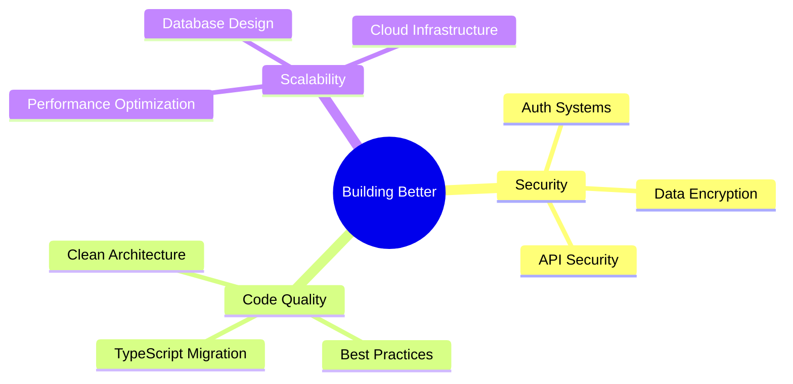

<div align="center">

#  Hey, I'm Dan Ken Shen Penera

### 🚀 Full-Stack Developer | System Architect | Digital Problem Solver


[](https://github.com/danken4445)
[](https://github.com/danken4445)
[](https://github.com/danken4445?tab=repositories)

</div>

---


## 🎯 What I Do

```typescript
const danken = {
    code: ["JavaScript", "TypeScript", "Node.js"],
    technologies: {
        frontEnd: ["React", "React Native", "Vite", "Tailwind CSS"],
        backEnd: ["Node.js", "Firebase", "REST APIs"],
        databases: ["Firestore", "Realtime Database"],
        cms: ["Headless CMS", "Analytics Integration"],
        tools: ["Git", "VS Code", "Postman"]
    },
    currentFocus: "Building scalable, secure systems",
    philosophy: "Build quiet. Let the work speak."
};
```

- 🎨 Craft **pixel-perfect** interfaces with React & React Native
- ⚙️ Architect **scalable applications** backed by Firebase & Node.js
- 💼 Build **showcase websites with CMS & analytics** for businesses
- 🔄 Transform **messy workflows** into digital systems that make sense

---

## 🏗️ Featured Projects

<div align="center">

| 🎯 Project | 🛠️ Stack | 📝 Description | 🔗 Link |
|-----------|----------|----------------|---------|
| **🏥 Clinic Management System** | React Native • Firebase • TypeScript | Digital transformation for hospital workflows with real-time data sync | `In Development` |
| **🚗 Car Rental Platform** | React • Vite • Firebase | Complete asset management & booking system with analytics | `In Development` |
| **💼 Business Showcase Sites** | React • Headless CMS • Analytics | Professional web presence with data-driven insights | `Active` |

</div>

---

## 📊 GitHub Analytics

<div align="center">
  
</div>

<div align="center">
  
</div>

<div align="center">
  
</div>

---

## 🚀 Tech Arsenal

<div align="center">

### Languages & Frameworks


### Tools & Platforms


### Currently Learning


</div>

---

## 🎯 Current Focus

<div align="center">



</div>

### 🔥 What I'm Working On

- 🔐 **Security-first architecture** - Building robust auth & authorization systems
- 📋 **Code standardization** - Implementing TypeScript across all projects
- 🔧 **System maintainability** - Creating scalable, future-proof solutions
- 📚 **Continuous learning** - Exploring Docker, PostgreSQL, and Next.js

> 💡 **Not here to just "make apps"** — I'm here to **build solutions that last**.

---

## 🏆 GitHub Trophies

<div align="center">
  
</div>

---

## 💼 Professional Services

<div align="center">

| Service | Description | Tech Stack |
|---------|-------------|------------|
| 🌐 **Web Development** | Modern, responsive websites with CMS | React • Vite • Tailwind CSS |
| 📱 **Mobile Apps** | Cross-platform mobile solutions | React Native • Firebase |
| 🔧 **System Architecture** | Scalable backend systems & APIs | Node.js • Firebase • REST |
| 📊 **Analytics Integration** | Data-driven insights for your business | Google Analytics • Custom Dashboards |

</div>

---

## 🕶️ Philosophy

<div align="center">

```ascii
╔══════════════════════════════════════╗
║                                      ║
║    Build quiet.                      ║
║    Let the work speak.               ║
║                                      ║
║    - Dan Ken Shen Penera             ║
║                                      ║
╚══════════════════════════════════════╝
```

</div>

---

## 📫 Let's Connect

<div align="center">

Building **business websites** or need a **full-stack solution**? Let's talk.

[](https://github.com/danken4445)
[](https://www.linkedin.com/in/dan-ken-shen-uriarte-penera-864199290/)
[](mailto:dankenn4445@gmail.com)

### 💬 Open to collaborating on projects that solve real problems


</div>

---

<div align="center">
  
</div>

<div align="center">
  
### ⭐ From [danken4445](https://github.com/danken4445) with 💙

**Show some ❤️ by starring some of the repositories!**

</div>
